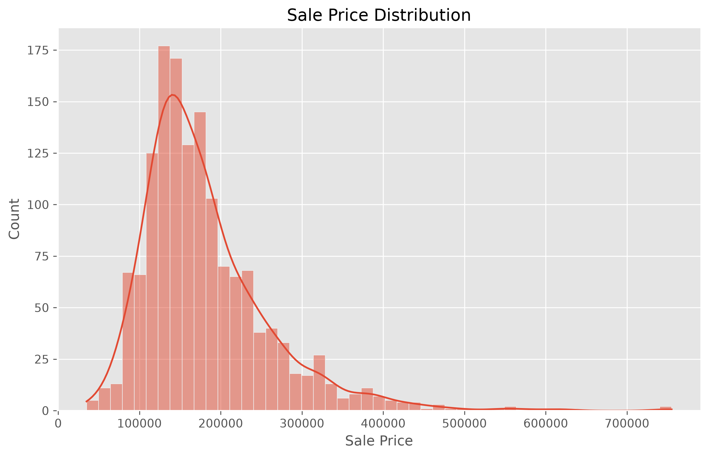
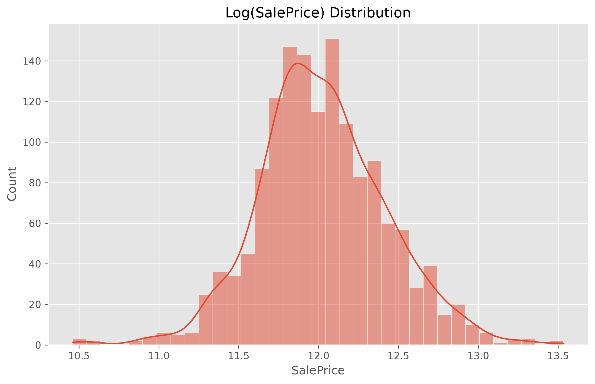
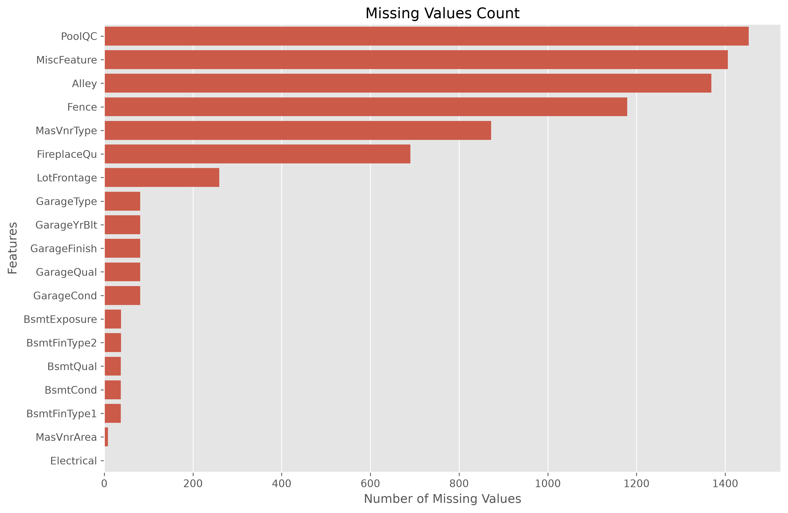
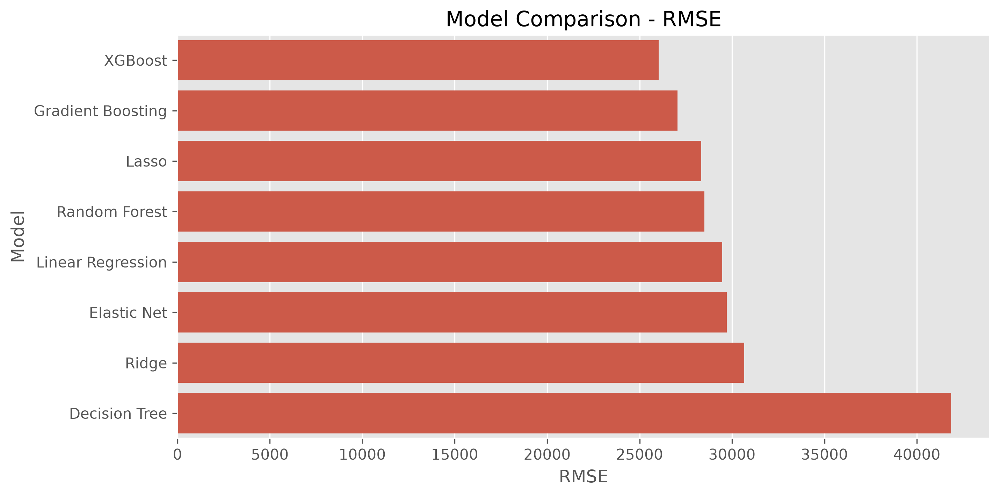

# 🏠 House Price Prediction using Machine Learning (XGBoost)

## 📌 Project Overview

This project predicts residential house prices using various Machine Learning regression algorithms on the **Ames Housing Dataset**. The objective was to compare multiple regression models, evaluate their performance, and select the most accurate model for predicting house prices.

The project includes:

- Exploratory Data Analysis (EDA)
- Data preprocessing
- Missing value handling
- Feature transformation
- Log transformation of the target variable
- Multiple regression model training
- Model evaluation and comparison
- Best model selection
- Model serialization using Joblib

After comparing all models, **XGBoost Regressor** achieved the best overall performance and was selected as the final model.

---

# 🎯 Project Objectives

- Analyze housing data
- Explore feature relationships
- Handle missing values
- Build a preprocessing pipeline
- Train multiple regression models
- Compare model performance
- Select the best-performing model
- Save the trained model for future predictions

---

# 📂 Dataset

This project uses the **House Prices: Advanced Regression Techniques (Ames Housing Dataset)** from Kaggle.

### Dataset Link

https://www.kaggle.com/competitions/house-prices-advanced-regression-techniques

### Download Dataset

https://www.kaggle.com/competitions/house-prices-advanced-regression-techniques/data

### Files Used

```text
house-prices-advanced-regression-techniques/
│
├── train.csv
├── test.csv
├── data_description.txt
└── sample_submission.csv
```

### Target Variable

```text
SalePrice
```

The target variable was log-transformed using:

```python
SalePrice = np.log1p(SalePrice)
```

to reduce skewness and improve regression performance.

---

# 📁 Project Structure

```text
House-Price-Prediction/
│
├── house-prices-advanced-regression-techniques/
│   ├── train.csv
│   ├── test.csv
│   ├── data_description.txt
│   └── sample_submission.csv
│
├── images/
│   ├── saleprice_distribution.png
│   ├── log_saleprice_distribution.png
│   ├── missing_values_count.png
│   └── model_comparison_rmse.png
│
├── models/
│   └── best_house_price_model.pkl
│
├── notebooks/
│   └── regression_analysis.ipynb
│
├── reports/
│   └── Regression_Model_Comparison_Report.pdf
│
├── src/
│   ├── preprocessing.py
│   ├── train_models.py
│   ├── evaluate.py
│   └── predict.py
│
├── requirements.txt
└── README.md
```

---

# ⚙️ Technologies Used

## Programming Language

- Python 3.14

## Libraries

- NumPy
- Pandas
- Matplotlib
- Seaborn
- Scikit-learn
- XGBoost
- Joblib

---

# 🔄 Machine Learning Workflow

```text
Dataset

↓

Exploratory Data Analysis (EDA)

↓

Missing Value Analysis

↓

Feature & Target Separation

↓

Log Transformation

↓

Train-Test Split

↓

Preprocessing Pipeline

↓

Model Training

↓

Model Evaluation

↓

Best Model Selection

↓

Model Saving

↓

Prediction
```

---

# 🧹 Data Preprocessing

The preprocessing pipeline includes:

### Numerical Features

- Median Imputation
- Standard Scaling

### Categorical Features

- Missing Value Replacement
- One-Hot Encoding

Implemented using:

- Pipeline
- ColumnTransformer

---

# 📌 Baseline Model

A **Multiple Linear Regression** model was used as the baseline model.

The performance of all other regression algorithms was compared against this baseline to evaluate improvements in prediction accuracy.

---

# 🤖 Regression Models

The following regression algorithms were trained and evaluated:

| Model | Purpose |
|--------|----------|
| Linear Regression | Baseline Model |
| Ridge Regression | L2 Regularization |
| Lasso Regression | L1 Regularization |
| Elastic Net | Combined Regularization |
| Decision Tree Regressor | Tree-Based Regression |
| Random Forest Regressor | Ensemble Learning |
| Gradient Boosting Regressor | Boosting |
| XGBoost Regressor | Advanced Gradient Boosting |

---

# 📊 Evaluation Metrics

The models were evaluated using:

- Mean Absolute Error (MAE)
- Root Mean Squared Error (RMSE)
- R² Score

These metrics were used to compare the predictive performance of every regression model.

---

# 🏆 Best Model

After evaluating all regression algorithms, **XGBoost Regressor** achieved the best performance.

### Final Model

```text
XGBRegressor
```

### Why XGBoost?

- Excellent performance on tabular datasets
- Captures nonlinear relationships
- Handles feature interactions effectively
- Lowest RMSE
- Lowest MAE
- Highest R² Score

The trained model was saved using Joblib for future predictions.

---

# 📈 Results

### Sale Price Distribution



---

### Log Transformed Sale Price



---

### Missing Values



---

### Model Comparison (RMSE)



---

# 💾 Model Saving

The trained model is stored as:

```text
models/best_house_price_model.pkl
```

Example:

```python
from src.predict import load_model

model = load_model(
    "models/best_house_price_model.pkl"
)
```

Prediction:

```python
predictions = model.predict(new_data)
```

---

# 🚀 How to Run

## Clone Repository

```bash
git clone https://github.com/cyberAbubakr/ML-Projects.git
```

---

## Navigate to Project

```bash
cd ML-Projects/Day-2/House-Price-Prediction
```

---

## Create Virtual Environment

```bash
python -m venv .venv
```

Windows

```bash
.venv\Scripts\activate
```

---

## Install Dependencies

```bash
pip install -r requirements.txt
```

---

## Run Notebook

Open:

```text
notebooks/regression_analysis.ipynb
```

Run every notebook cell sequentially.

---

# 📌 Key Features

- Complete EDA
- Missing value analysis
- Data visualization
- Log transformation
- Preprocessing pipeline
- Multiple regression algorithms
- Model comparison
- XGBoost implementation
- Model serialization
- Clean project structure

---

# ⚠️ Limitations

- No hyperparameter tuning was performed.
- Limited feature engineering.
- Results depend on the Ames Housing Dataset.
- Performance may vary on different housing datasets.

---

# 🚀 Future Improvements

- Hyperparameter tuning using GridSearchCV or Optuna
- K-Fold Cross Validation
- Residual Analysis
- Advanced Feature Engineering
- SHAP Explainability
- Streamlit Dashboard
- FastAPI Deployment
- Docker Containerization

---

# 👨‍💻 Author

**Abubakr Kazmi**

BS Computer Science Student

Machine Learning & AI Enthusiast

GitHub: https://github.com/cyberAbubakr

---

# ⭐ Project Status

- ✅ Exploratory Data Analysis Completed
- ✅ Data Preprocessing Completed
- ✅ Multiple Regression Models Trained
- ✅ Model Evaluation Completed
- ✅ XGBoost Selected as Best Model
- ✅ Model Saved Successfully
- ✅ Project Documentation Completed
- 🚧 Future Enhancements Planned
